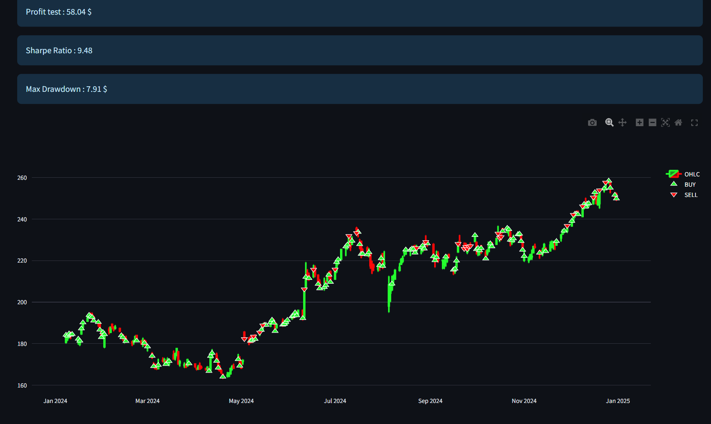

# Agent de Trading Automatique - Q-Learning

Ce projet met en œuvre un **agent de trading automatique** basé sur **Q-Learning** pour apprendre des stratégies d'achat et de vente sur des données boursières historiques (Apple - AAPL). Il offre une interface utilisateur intuitive via **Streamlit** pour le paramétrage, l'entraînement, le test et la visualisation de la Q-table.

## Fonctionnalités

### 1. Chargement des Données
- Extraction des données historiques de l'action **Apple (AAPL)** via Yahoo Finance.
- Définir les dates de début et de fin.
- Option pour activer le **mode rapide** (300 jours de données, 10 épisodes max).

### 2. Entraînement Q-Learning
- Nombre d’épisodes personnalisable (entre 10 et 500).
- Affichage du **profit total** par épisode.
- Q-Learning avec une Q-table construite dynamiquement selon les états-actions.

### 3. Test de l'Agent
- Évaluation sur des données test.
- Affichage du **Profit**, **Sharpe Ratio**, **Max Drawdown**.
- Visualisation claire des signaux **Buy/Sell** sur le graphique des prix.

### 4. Q-Table
- Affichage des 10 meilleurs états (selon la valeur Q maximale).
- Vue tabulaire des actions : **Hold**, **Buy**, **Sell**.

---

## Aperçu de l’Interface

### Chargement des données


### Entraînement Q-Learning


### Backtest sur données test



### animation


### Q-table (top 10 états)


---

## Installation et Lancement

### Prérequis

- Python 3.8+
- [Streamlit](https://streamlit.io/)
- `yfinance`, `pandas`, `numpy`, `matplotlib`

### Installation

```bash
git clone https://github.com/votre-utilisateur/agent-trading-qlearning.git
cd agent-trading-qlearning
```
### Étapes pour exécuter l’interface


```bash
cd ui/

streamlit run app.py
```

## Auteurs

Ce projet a été réalisé par :

- **EL HACHYMI Ahmed Yassine**
- **AKESBI Alae-Eddine**
- **BAGUENA Mohammed Amine**
- **AJI Othman**

## Encadré par :  

**Mr. Mohamed Khalifa BOUTAHIR**

Projet développé dans le cadre d’une démonstration d’agent de trading intelligent basé sur le Q-Learning.
